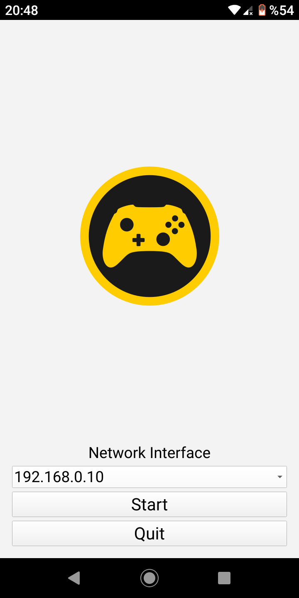

# MOCON: Mobile Game Controller Emulator
A controller emulating gamepad on mobile devices, and connecting to computers via udp. Written in C++ using the Qt framework. Currently only implemented for android (controller emulattion) and linux (driver emulation).

## Initial Screen
{width=180 height=360}

## Sending Input
{width=360 height=180}

Here's a [video](https://youtu.be/MWMWvk8R2r0) example of how it works on a laptop with ubuntu 20 and an android phone. 

## Credit
I'd like to thank [Marek Krauss](https://blog.marekkraus.sk) for putting together this awesome example and making it publicly available. Using the linux documentation alone would have taken me much longer to write the driver side. Thanks to Marek it was a piece of cake. Here's his original example:
https://blog.marekkraus.sk/c/linuxs-uinput-usage-tutorial-virtual-gamepad/
