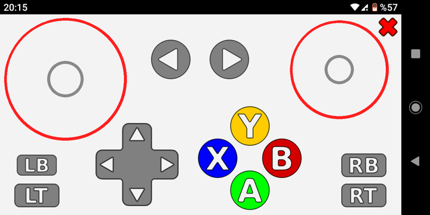

# MOCON: Mobile Game Controller Emulator
A controller emulating gamepad on mobile devices, and connecting to computers via udp. Written in C++ using the Qt framework. Currently only implemented for android (controller emulattion) and linux (driver emulation).

Here's a [video](https://youtu.be/DFS32ejTlV0) example of how it works on a laptop with ubuntu 20 and an android phone. 

