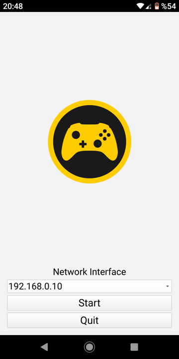

# MOCON: Mobile Game Controller Emulator
A controller emulating gamepad on mobile devices, and connecting to computers via udp. Written in C++ using the Qt framework. Currently only implemented for android (controller emulattion) and linux (driver emulation).

## Initial Screen
{width=180 height=360}

## Sending Input
{width=360 height=180}

Here's a [video](https://youtu.be/MWMWvk8R2r0) example of how it works on a laptop with ubuntu 20 and an android phone. 

## Build
There are two components to build, the controller and the driver. You'll need Qt 5.15 and all the modules listed in `mobile-game-controller-emulator.pro`.

### Controller
The controller works on Android alone and it was tested on a GM8 phone with Android 9. Pass the argument `CONFIG+=controller` when calling qmake to build the controller. You'll also have to modify the statement `ANDROID_ABIS = armeabi-v7a` at line 69 in the file `mobile-game-controller-emulator.pro` if your android phone is a different architecture.

### Driver
The driver currently supports linux alone (tested on Ubuntu 18.04 and Ubuntu 20.04). Pass the argument `CONFIG+=driver` when calling qmake to build the driver. You'll need to call the executable with sudo otherwise it will fail to open uinput.

## Credit
I'd like to thank [Marek Kraus](https://blog.marekkraus.sk) for putting together this awesome [example](https://blog.marekkraus.sk/c/linuxs-uinput-usage-tutorial-virtual-gamepad/) and making it publicly available. Using the linux documentation alone would have taken me much longer to write the driver side. Thanks to Marek it was a piece of cake.
